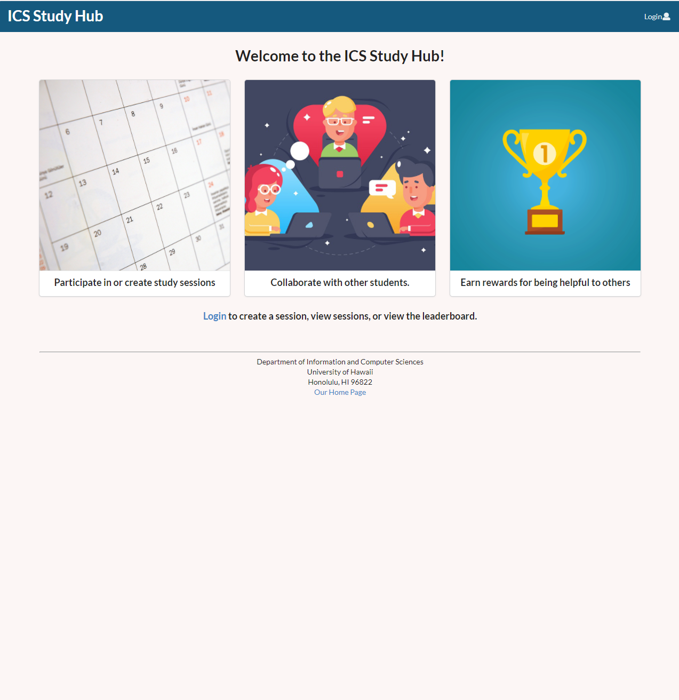
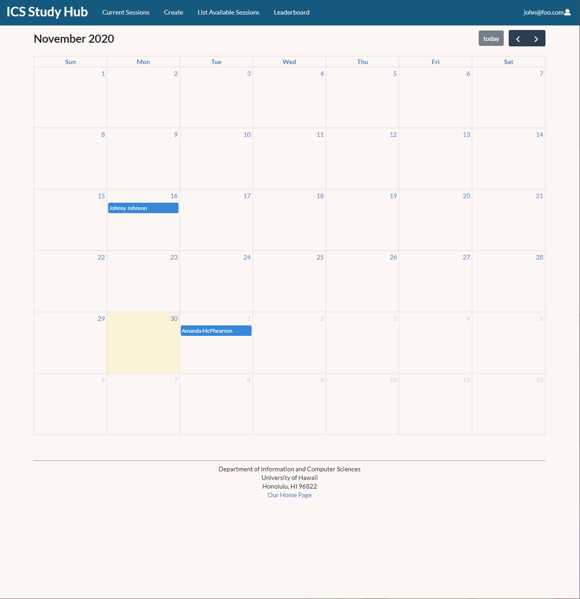
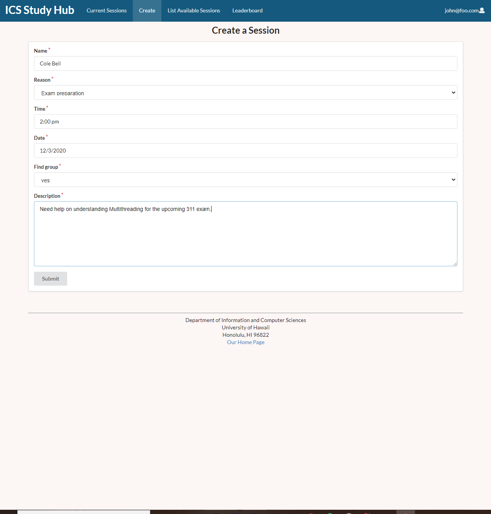
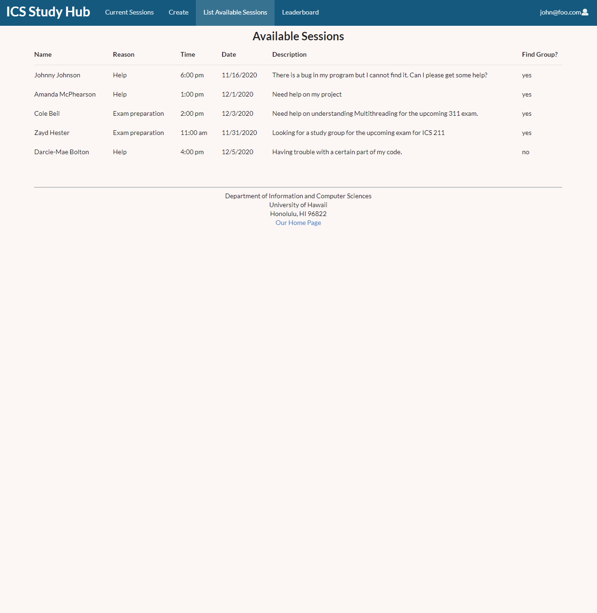
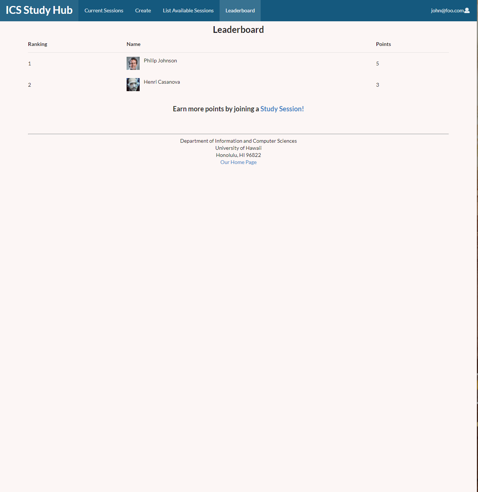
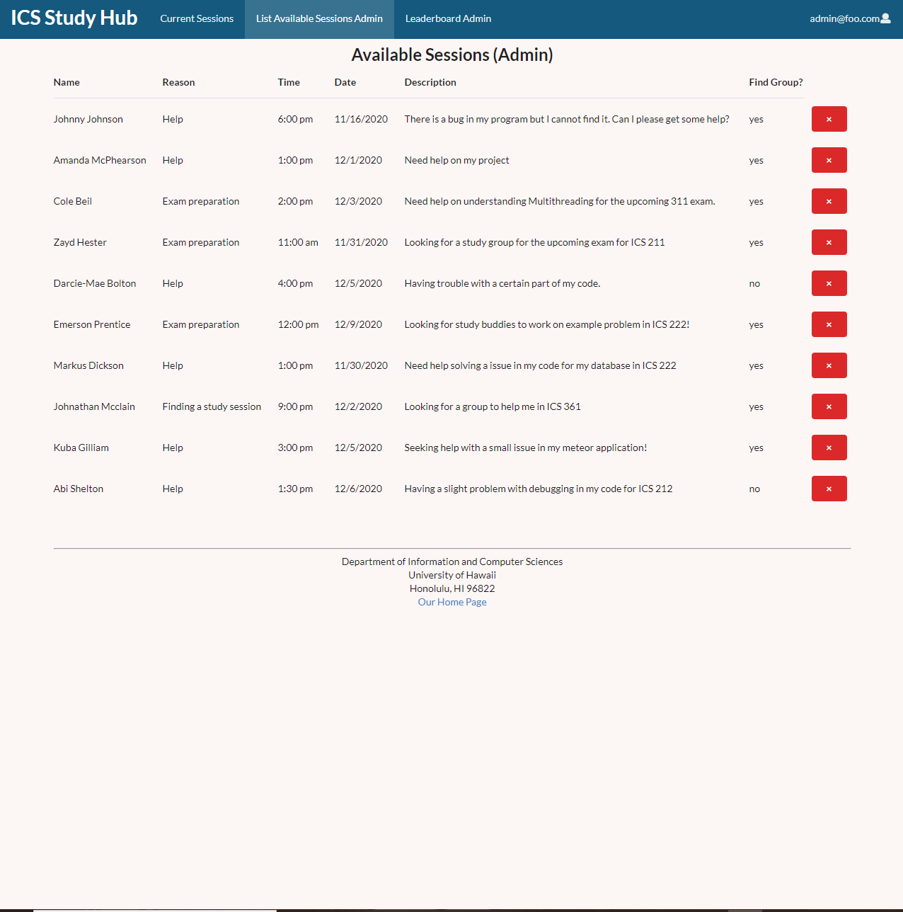
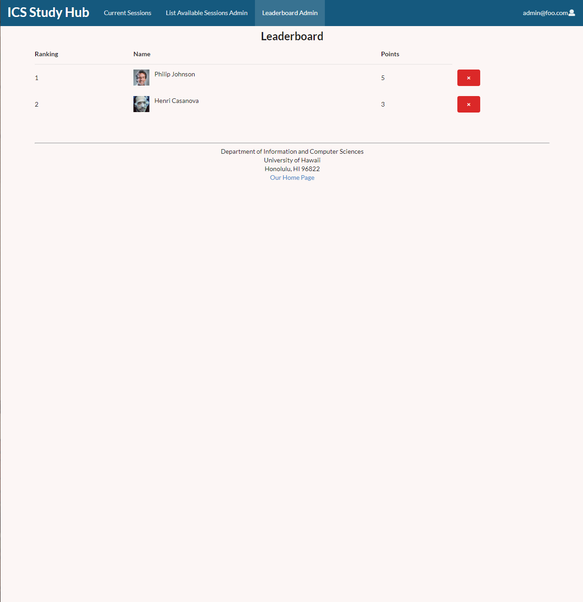

## Table of contents
* [Team](#testing)
* [Overview](#overview)
* [Pages](#pages)

## OVERVIEW
COVID-19 has hit not just America, but the entire world very hard. From the workplace to home, people are struggling and education is now more important than ever. We are hoping that our template for the ICS Study Hub will provide the support needed for ICS students and hopefully provide a template for study websites not just all over the country, but as well as across the globe.

## A Work in Progress
As you may have guessed, this page is a work in progress. Every week and a half, there will be an update regarding the progress of each page, including but not limited to images of pages, notes regarding functionality, possible problems, and more.

## Our next milestone...
Attached is a link to what we plan to accomplish in our next milestone:


[Milestone One](https://github.com/ics-study-hub/ics-study-hub/projects/1)


[Milestone Two](https://github.com/ics-study-hub/ics-study-hub/projects/2)

## PAGES:
[Landing Page:](http://159.89.134.191/#/)


[Calendar Page:](http://159.89.134.191/#/usercalendar)


[Create Study Session](http://159.89.134.191/#/create)


[List Sessions Page:](http://159.89.134.191/#/list)


[Game Mechanics Page:](http://159.89.134.191/#/leaderboard)


[Admin List Session:]


[Admin Leaderboard:]


## Developer Guide
This section provides information of interest to Meteor developers wishing to use this code base as a basis for their own development tasks.

# Installation
First, [install Meteor](https://www.meteor.com/install).

Second, go to the [ICS Study Hub page](https://github.com/ics-study-hub/ics-study-hub), and click the "Use this template" button. Complete the dialog box to create a new repository that you own that is initialized with this template's files.

Third, go to your newly created repository, and click the "Clone or download" button to download your new GitHub repo to your local file system.  Using [GitHub Desktop](https://desktop.github.com/) is a great choice if you use MacOS or Windows.

Fourth, cd into the app/ directory of your local copy of the repo, and install third party libraries with:

```
$ meteor npm install
```

## Running the system

 Once the libraries are installed, you can run the application by invoking the "start" script in the [package.json file](https://github.com/ics-study-hub/ics-study-hub/blob/master/app/package.json):

 ```
 $ meteor npm run start
 ```

 The first time you run the app, it will create some default users and data.

## TEAM
Len Nguyen, Shengtong Jin, Matthew Kirts, Justin Aquino
