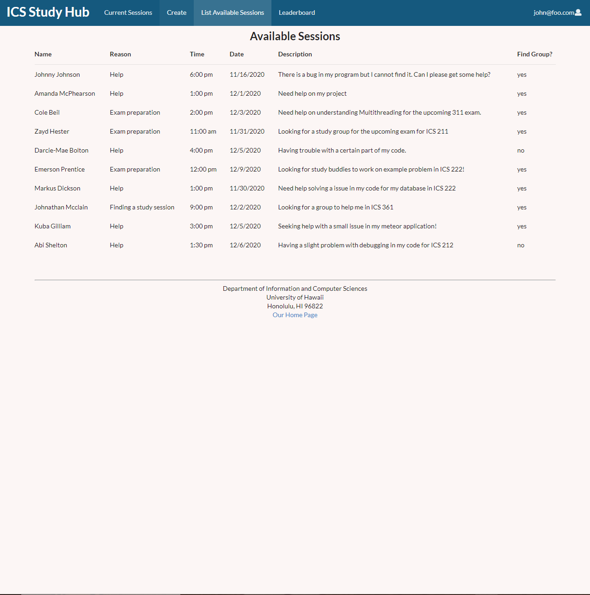

## Table of contents
* [Overview](#overview)
* [Deployment](#deployment)
* [User Guide](#user-guide)
* [Developer Guide](#developer-guide)
* [Team](#team)

## OVERVIEW
COVID-19 has hit not just America, but the entire world very hard. From the workplace to home, people are struggling and education is now more important than ever. We are hoping that our template for the ICS Study Hub will provide the support needed for ICS students and hopefully provide a template for study websites not just all over the country, but as well as across the globe.

## Deployment

A live deployment of ICS Study Hub is available at [http://icsstudyhub.xyz](http://icsstudyhub.xyz).

## Our next milestone...
Attached is a link to what we plan to accomplish in our next milestone:


[Milestone One](https://github.com/ics-study-hub/ics-study-hub/projects/1)


[Milestone Two](https://github.com/ics-study-hub/ics-study-hub/projects/2)

[Milestone Three](https://github.com/ics-study-hub/ics-study-hub/projects/3)


## User Guide:

### [Landing Page:](http://icsstudyhub.xyz/#/)
The landing page is presented to users when they visit the top-level URL to the site.


### [Calendar Page:](http://icsstudyhub.xyz/#/usercalendar)
Clicking on the Current Sessions tab will bring the user to a page with a calendar where users can see all the current sessions that are available and create new ones within the page.


### [Create Study Session:](http://icsstudyhub.xyz/#/create)
In the Create tab the user will be brought to a page where they can fill out a form and specify the details of their new study sessions to everyone.


### [List Sessions Page:](http://icsstudyhub.xyz/#/list)
The List Available Sessions shows all the current study sessions that are available for students to join!


### [Game Mechanics Page:](http://icsstudyhub.xyz/#/leaderboard)
Having a Leaderboard keeps the students motivated to study and in return they can earn rewards if they study hard enough.


### [Admin List Session:](http://icsstudyhub.xyz/#/admin)
The Admin List Session is the same as what the user will see except they have the ability to remove posts after the time has passed or the user wants the session to be deleted.


### [Admin Leaderboard:](http://icsstudyhub.xyz/#/leaderboardadmin)
The Leaderboard also the same where an admin can see the current leaderboard but if there was a student not following the rules then the admin is able to remove them from the leaderboard.


## Community Feedback

Here what others think of our application and the benefits that comes with it!

## Developer Guide
This section provides information of interest to Meteor developers wishing to use this code base as a basis for their own development tasks.

### Installation
First, [install Meteor](https://www.meteor.com/install).

Second, go to the [ICS Study Hub page](https://github.com/ics-study-hub/ics-study-hub), and click the "Use this template" button. Complete the dialog box to create a new repository that you own that is initialized with this template's files.

Third, go to your newly created repository, and click the "Clone or download" button to download your new GitHub repo to your local file system.  Using [GitHub Desktop](https://desktop.github.com/) is a great choice if you use MacOS or Windows.

Fourth, cd into the app/ directory of your local copy of the repo, and install third party libraries with:

```
$ meteor npm install
```

Finally, an additional library is required due to the interactive calendar we have installed in our site. Install this library with:

```
$ npm install --save @fullcalendar/react @fullcalendar/daygrid
```

### Running the system

 Once the libraries are installed, you can run the application by invoking the "start" script in the [package.json file](https://github.com/ics-study-hub/ics-study-hub/blob/master/app/package.json):

 ```
 $ meteor npm run start
 ```

 The first time you run the app, it will create some default users and data. Here is the output:


```
meteor npm run start

> meteor-application-template-react@ start C:\Users\Len Nguyen\Documents\GitHub\ics-study-hub\app
> meteor --no-release-check --exclude-archs web.browser.legacy,web.cordova --settings ../config/settings.development.json

[[[[[ C:\Users\Len Nguyen\Documents\GitHub\ics-study-hub\app ]]]]]

=> Started proxy.
=> Started MongoDB.
W20201130-22:47:36.140(-10)? (STDERR) Note: you are using a pure-JavaScript implementation of bcrypt.
W20201130-22:47:36.187(-10)? (STDERR) While this implementation will work correctly, it is known to be
W20201130-22:47:36.187(-10)? (STDERR) approximately three times slower than the native implementation.
W20201130-22:47:36.188(-10)? (STDERR) In order to use the native implementation instead, run
W20201130-22:47:36.188(-10)? (STDERR)
W20201130-22:47:36.188(-10)? (STDERR)   meteor npm install --save bcrypt
W20201130-22:47:36.188(-10)? (STDERR)
W20201130-22:47:36.189(-10)? (STDERR) in the root directory of your application.
I20201130-22:47:37.554(-10)? Creating the default user(s)
I20201130-22:47:37.554(-10)?   Creating user admin@foo.com.
I20201130-22:47:37.772(-10)?   Creating user john@foo.com.
I20201130-22:47:37.965(-10)? Creating default data.
I20201130-22:47:37.965(-10)?   Adding: Johnny Johnson (john@foo.com)
I20201130-22:47:37.988(-10)?   Adding: Amanda McPhearson (john@foo.com)
I20201130-22:47:37.990(-10)? Creating default leaderboard.
I20201130-22:47:37.990(-10)?   Adding: Philip Johnson (john@foo.com)
I20201130-22:47:38.010(-10)?   Adding: Henri Casanova (john@foo.com)
I20201130-22:47:38.095(-10)? Monti APM: completed instrumenting the app
=> Started your app.

=> App running at: http://localhost:3000/

```

### Walkthrough

The following sections describe the major features of this template.

### Directory structure

The top-level directory structure is:

```
app/        # holds the Meteor application sources
config/     # holds configuration files, such as settings.development.json
doc/        # holds developer documentation, user guides, etc.
.gitignore  # don't commit IntelliJ project files, node_modules, and settings.production.json
```

This structure separates documentation files (such as screenshots) and configuration files (such as the settings files) from the actual Meteor application.

The app/ directory has this structure:

```
client/
  main.html      # The boilerplate HTML with a "root" div to be manipulated by React.
  main.js        # import startup files.

imports/
  api/           # Define collections
    stuff/       # The Stuffs collection definition
  startup/       # Define code to run when system starts up (client-only, server-only, both)
    client/
    server/
  ui/
    layouts/     # Contains top-level layout (<App> component).
    pages/       # Contains components for each page.
    components/  # Contains page elements, some of which could appear on multiple pages.

node_modules/    # managed by npm

public/          # static assets (like images) can go here.

server/
   main.js       # import the server-side js files.
```


## TEAM
Len Nguyen, Shengtong Jin, Matthew Kirts, Justin Aquino
