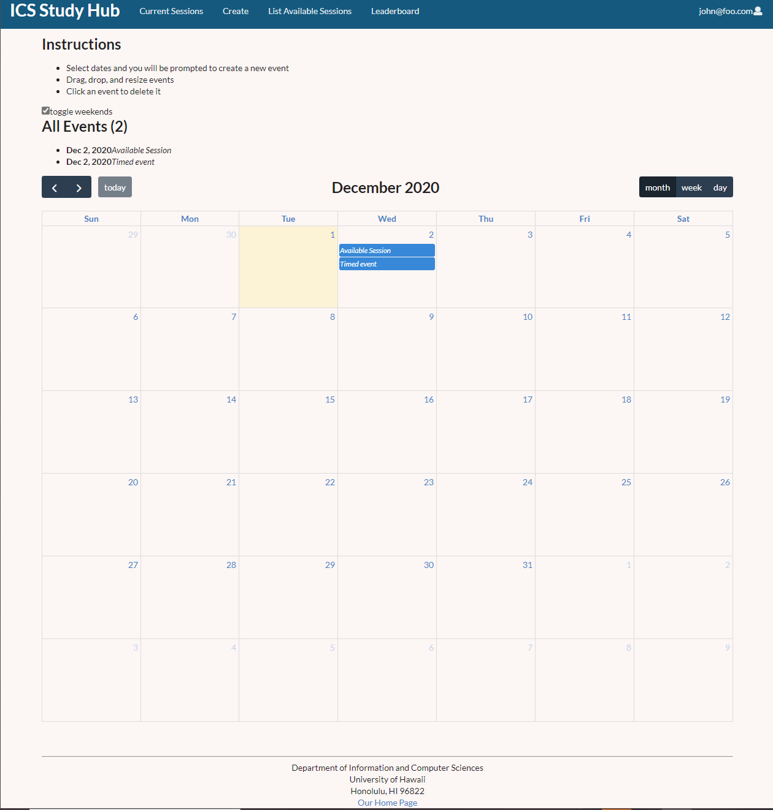

## Table of contents
* [Team](#testing)
* [Overview](#overview)
* [Pages](#pages)

## OVERVIEW
COVID-19 has hit not just America, but the entire world very hard. From the workplace to home, people are struggling and education is now more important than ever. We are hoping that our template for the ICS Study Hub will provide the support needed for ICS students and hopefully provide a template for study websites not just all over the country, but as well as across the globe.

## A Work in Progress
As you may have guessed, this page is a work in progress. Every week and a half, there will be an update regarding the progress of each page, including but not limited to images of pages, notes regarding functionality, possible problems, and more.

## Our next milestone...
Attached is a link to what we plan to accomplish in our next milestone:

[Milestone One](https://github.com/ics-study-hub/ics-study-hub/projects/1)

[Milestone Two](https://github.com/ics-study-hub/ics-study-hub/projects/2)

## PAGES:
[Landing Page:](http://159.89.134.191/#/)

[Calendar Page:](http://159.89.134.191/#/usercalendar)

[Create Study Session](http://159.89.134.191/#/create)

[List Sessions Page:](http://159.89.134.191/#/list)

[Game Mechanics Page:](http://159.89.134.191/#/leaderboard)

[Admin List Session:]

[Admin Leaderboard:]

## Developer Guide

## TEAM
Len Nguyen, Shengtong Jin, Matthew Kirts, Justin Aquino
